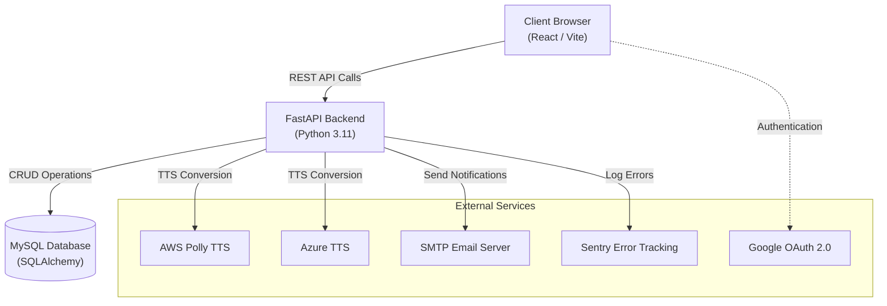

# 🎧 Neural Voice

**Neural Voice** is an advanced Text-to-Speech (TTS) SaaS application designed to help users convert text and documents into lifelike speech. It features a modern, responsive user interface and a robust backend capable of handling complex natural language processing tasks.

---

## 🚀 Key Features

- **Multi-Engine Voice Generation**: High-quality speech synthesis powered by **AWS Polly** and **Azure**.
- **Advanced Text Tuning**: Assign different voices to individual sentences and select specific emotion/mood styles for natural-sounding speech.
- **PDF Text Extraction**: Seamless document processing and text extraction from uploaded PDFs utilizing `pdfplumber`.
- **User Authentication**: Secure signup and login via standard email/password credentials and **Google OAuth 2.0** (Continue with Google).
- **Credit & Plan Management**: Credit-based usage system with different tiers (Basic, Pro, etc.), plan limits, and credit tracking.
- **Email Communication**: Dedicated **SMTP Server** integration for sending automated Password Reset instructions.
- **Conversion History**: Database-backed historical tracking of generated audio with playback and history management.
- **Admin Dashboard**: Update user plans and get system statistics.
- **Automated CI/CD**: Fully automated deployment pipeline using **GitLab CI/CD**.

---

## 🛠 Tech Stack

### Backend
- **Framework**: FastAPI (Python 3.11)
- **Database**: MySQL with SQLAlchemy ORM
- **TTS Engine**: AWS Polly (Boto3) & Azure
- **Authentication**: JWT (JSON Web Tokens) & Google OAuth 2.0
- **PDF Processing**: `pdfplumber`

### Frontend
- **Framework**: React (Vite)
- **Styling**: TailwindCSS
- **State/API**: Axios, React Router

---

## 🏗 Architecture Diagram



---

## 🧵 Long Text Processing (Chunking & Stitching)

One of the standout features of Neural Voice is its ability to handle immense blocks of text. Since most TTS engines have character limits per request (e.g., AWS Polly's 3,000 character limit), we implemented a **Smart Splitter**:

1. **Smart Splitting**: If text exceeds 3,000 characters, it is split at the nearest sentence ending (`.` `?` `!`) to ensure natural pauses.
2. **Sequential Processing**: Each chunk is sent to AWS Polly/Azure independently.
3. **Audio Stitching**: Using **Pydub**, the resulting audio streams are concatenated into a single high-quality MP3 file.
4. **Unified Output**: The user receives a single audio URL for the entire long-form content.

---

## 🚀 CI/CD & Deployment

This project uses a robust **GitLab CI/CD** pipeline for automated testing and deployment:
- **Build Stage**: Frontend is automatically built using Node.js 18.
- **Deploy Stage**: Verified code is automatically deployed to the production server (**MilesWeb**) via LFTP.
- **FTP & SSH Sync**: Transfers files securely and executes automation commands via SSH on a custom port (`22999`).
- **Complete Auto-Provisioning**: The pipeline automatically runs `pip install -r requirements.txt` and reboots the FastAPI server seamlessly on every deploy.

---

## 🛡️ Error Monitoring & Sentry

For production stability, we use **Sentry** for real-time error tracking:
- **Runtime Error Detection**: Any backend exception is instantly captured by Sentry.
- **Instant Alerts**: Sentry sends an immediate email notification with a full traceback whenever a critical error occurs in the production environment.
- **Traceability**: Every error includes request details, helping to identify and fix bugs before they affect more users.

---

## 🔮 Future Improvements

1. **Voice Cloning**: Integrate The APIs for custom voice cloning capabilities.
2. **SSML Editor**: A visual editor for Speech Synthesis Markup Language to control pitch, speed, and emphasis.
3. **Batch Processing**: Upload `txt` or `docx` files for bulk conversion.
4. **Webhooks**: Notify external systems when a conversion is complete.

---

## � API Documentation

| Endpoint | Method | Description |
|----------|--------|-------------|
| `/api/signup` | POST | Register a new user |
| `/api/login` | POST | Authenticate and receive JWT |
| `/api/auth/google` | POST | Authenticate via Google OAuth |
| `/api/me` | GET | Current user profile & credits |
| `/api/convert` | POST | Main TTS conversion (handles chunking) |
| `/api/extract-pdf` | POST | Extract text from uploaded PDF files |
| `/api/history` | GET | List user conversion history |
| `/api/download/{id}` | GET | Download specific audio file |
| `/api/admin/stats` | GET | Global system statistics (Admin only) |
| `/api/admin/plans/{plan_name}` | PUT | Update plan limits (Admin only) |

---

## ⚙️ Installation & Setup

### Prerequisites
- **Python 3.11+**
- **Node.js 18+**
- **MySQL Server**
- **FFmpeg** (Required for audio stitching)

### Database Setup
Create a new MySQL database for the application:
```sql
CREATE DATABASE pollyglot_db;
```

### Backend Setup
1. **Navigate to backend folder**:
    ```bash
    cd backend
    ```
    
2. **Create a virtual environment**:
    ```bash
    python -m venv venv
    source venv/bin/activate  # On Windows: venv\Scripts\activate
    ```
    
3. **Install dependencies**:
    ```bash
    pip install -r requirements.txt
    ```
    
4. **Configure Environment Variables**:
   Create a `.env` file in the `backend/` directory:
    ```env
    # Database Connection
    DATABASE_URL=mysql+mysqlconnector://<db_user>:<db_pass>@localhost/pollyglot_db
    
    # Security
    JWT_SECRET=your_super_secret_jwt_key
    ALGORITHM=HS256
    
    # Google Authentication
    GOOGLE_CLIENT_ID=your_google_client_id.apps.googleusercontent.com
    
    # AWS Polly Credentials
    AWS_ACCESS_KEY_ID=your_aws_key
    AWS_SECRET_ACCESS_KEY=your_aws_secret
    AWS_REGION=us-east-1
    
    # SMTP Configuration
    MAIL_USERNAME=your_email@domain.com
    MAIL_PASSWORD=your_email_password
    MAIL_FROM=your_email@domain.com
    MAIL_PORT=587
    MAIL_SERVER=smtp.domain.com
    
    # Other
    FRONTEND_PATH=../frontend/dist
    SENTRY_DSN=your_sentry_dsn (optional)
    ```
    
5. **Run the server**:
    ```bash
    uvicorn main:app --reload --port 8000
    ```

### Frontend Setup
1. **Navigate to frontend folder**:
    ```bash
    cd frontend
    ```
    
2. **Install dependencies**:
    ```bash
    npm install
    ```
    
3. **Configure Environment Variables**:
   Create a `.env` file:
    ```env
    VITE_API_URL=http://localhost:8000
    ```
    
4. **Start the development server**:
    ```bash
    npm run dev
    ```

---

## 📄 License

This project is licensed under the MIT License.

---
*Developed by HappyBrain Group*
